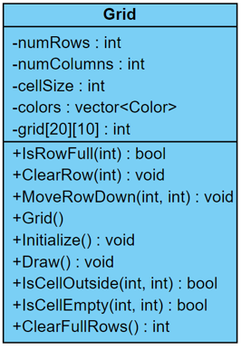
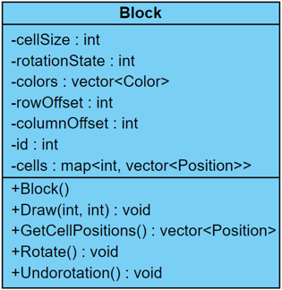
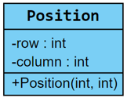
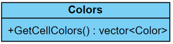
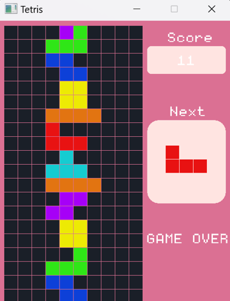

# Tetris 俄羅斯方塊

## 組員
- 1A 孫壢凱
- 1A 張家碩
- 1A 陳宥嘉

## 建置
1. 將專案複製到本地端
    ```bash
    git clone https://github.com/LiKai2507/Tetris.git
    ```

2. 進入專案資料夾
    ```bash
    cd Tetris
    ```
3. 編譯專案
    ```bash
    run build.bat
    ```

## UML
 





## 運行畫面



